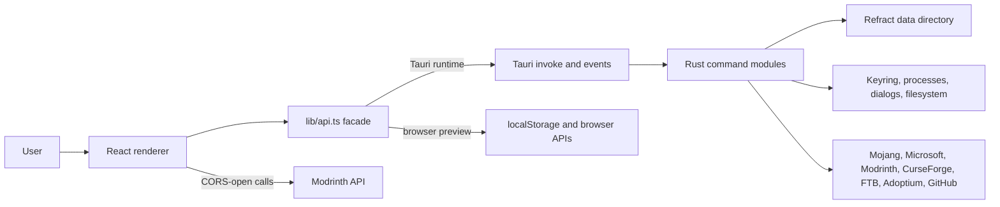

---
aliases:
  - Refract Project Knowledge
  - Refract Knowledge Base
tags:
  - refract
  - minecraft-launcher
  - project-knowledge
  - architecture
status: living
created: 2026-07-19
updated: 2026-07-19
project_version: 1.3.1
repository: https://github.com/RefractMC/Refract_MC
---

# Refract project knowledge base

> [!abstract] Purpose
> This is the shared, Obsidian-friendly source of truth for people and AI assistants working on Refract. It describes the project as implemented in the repository, not only as advertised. Update it whenever architecture, commands, persisted data, release steps, or major features change.

> [!info] Snapshot
> Reviewed against `main` on 2026-07-19. The desktop application is version `1.3.1`; `main` also contains AUR packaging work made after the `v1.3.1` tag. The root `package.json` version is older and is not the desktop release version.

## Quick facts

| Item | Value |
| --- | --- |
| Product | Refract, an open-source Minecraft Java Edition launcher |
| Primary runtime | Tauri 2 desktop shell with a Rust backend |
| UI | React 18, TypeScript, Vite 8, Tailwind CSS 4 |
| Routing and server state | TanStack Router and TanStack Query |
| Local UI state | Zustand with localStorage persistence |
| Monorepo | pnpm workspaces |
| Platforms | Windows, macOS Intel/Apple Silicon, Linux |
| License | GPL-3.0 |
| App identity | `com.refract` |
| Custom URL scheme | `refract://` |
| Canonical repository | https://github.com/RefractMC/Refract_MC |
| Website | https://refractmc.net |

The product goal is a focused launcher that owns instance organization, Minecraft installation and launch, accounts, Java runtimes, community content, worlds, screenshots, servers, skins, themes, updates, and diagnostics.

## Mental model



The most important architectural rule is: UI components call the stable `api.*` facade in `apps/renderer/src/renderer/src/lib/api.ts`. They should not invoke arbitrary Tauri commands directly. Rust commands are registered centrally in `apps/tauri/src-tauri/src/lib.rs`.

## Repository map

| Path | Responsibility | Notes |
| --- | --- | --- |
| `apps/renderer` | Shared React renderer | The live UI source is nested under `src/renderer/src`. |
| `apps/tauri` | Production desktop application | Vite host plus the Rust/Tauri backend. |
| `packages/core` | Shared TypeScript models and helpers | Contains instance/content types and some older Node-oriented launcher code. Rust is authoritative for native runtime behavior. |
| `packages/plugin-api` | Minimal public plugin type contract | Interfaces exist, but no complete runtime plugin loader is present. |
| `locales` | Translation JSON | English is the schema/fallback; Ukrainian and Simplified Chinese are registered. |
| `logo` | Brand and README assets | Includes icons and the current screenshot. |
| `packaging/aur` | Arch User Repository package | Binary package consumes the stable RPM release asset. |
| `.github/workflows` | Build, audit, release, AUR, and Discord automation | CI uses Node 24 and pnpm 11. |
| `README.md` | Product overview and public setup | Start here for users. |
| `CONTRIBUTING.md` | Contributor rules and checks | Keep changes focused and report verification. |
| `apps/tauri/RELEASING.md` | Release operations | Signing, publishing, and AUR automation. |
| `CHANGELOG.md` | User-visible release history | Add short, concrete release entries. |
| `SECURITY.md` | Vulnerability reporting and audit exceptions | Security reports should be private. |

### Important source entry points

- Renderer boot: `apps/renderer/src/renderer/src/main.tsx`
- Root layout: `apps/renderer/src/renderer/src/routes/__root.tsx`
- App shell: `apps/renderer/src/renderer/src/components/layout/AppShell.tsx`
- API boundary: `apps/renderer/src/renderer/src/lib/api.ts`
- Renderer API types: `apps/renderer/src/renderer/src/env.d.ts`
- Generated route tree: `apps/renderer/src/renderer/src/routeTree.gen.ts`
- Tauri boot: `apps/tauri/src-tauri/src/main.rs` and `lib.rs`
- Tauri configuration: `apps/tauri/src-tauri/tauri.conf.json`
- Native capabilities: `apps/tauri/src-tauri/capabilities/default.json`
- Core instance model: `packages/core/src/instance-manager/index.ts`

## Runtime behavior

### Startup

1. Tauri creates a maximized, centered, frameless `1280 x 800` main window with a `900 x 600` minimum.
2. The single-instance plugin focuses the existing window when a second process starts.
3. Deep links, dialogs, updater, and process plugins are registered.
4. Linux disables the WebKitGTK DMA-BUF renderer by default to avoid blank frames and freezes.
5. Analytics initializes, but sends nothing if the build has no `GA_API_SECRET` or the user opted out.
6. Quick Play command-line arguments can immediately launch an instance.
7. React initializes error logging and the persisted theme, then mounts a hash router and Query client.
8. The renderer updater checks GitHub Releases and rechecks every 30 minutes while the app stays open.

### Create, install, and launch

1. Creating an instance writes `instance.json`, assigns a UUID, creates a safe folder name, and initializes playtime and mod metadata.
2. Installing Minecraft downloads the version JSON, client jar, allowed libraries, natives, and assets. Fabric/Quilt use loader overlays; Forge/NeoForge run their installer processors.
3. Downloads use a shared Rust engine with connection pooling, bounded concurrency, retries, `.part` files, hash/size verification, and atomic rename.
4. Launch resolves the active account, refreshes authenticated tokens inside Rust, chooses or downloads a compatible Java runtime, merges loader metadata, builds JVM/game arguments, runs optional pre-launch hooks, and starts Minecraft.
5. Output streams over `mc://log`; exit state streams over `mc://exit`. Playtime is added to lifetime and local-calendar-day totals.
6. Optional Quick Play targets open a saved world or server directly. Optional offline launch skips token refresh.

### Content installation

- Modrinth is CORS-open, so project search/detail requests can run in the renderer. Native code still owns downloads and filesystem writes.
- CurseForge and FTB calls go through Rust because CurseForge needs an API key and both need native/CORS handling.
- Mods, resource packs, shaders, and datapacks are installed per instance.
- Required dependencies are resolved recursively; optional dependencies can be selected by the user.
- CurseForge files with API distribution disabled use the supported manual flow: Refract opens the official download page and watches the Downloads directory for the expected file/hash. It does not bypass author restrictions.
- Modpacks support Modrinth `.mrpack`, CurseForge manifests, FTB packs, and local archive imports.
- Modpack updates reuse the instance and replace its mod set while preserving worlds, options, screenshots, and other player data.

## User-facing areas

| Route | Page | Main responsibilities |
| --- | --- | --- |
| `/` | Library | Instances, groups, search/filter/pinning, install/launch/stop, console, crash reports, imports, external launcher sync, bulk actions, updates, activity, and playtime. |
| `/browse/` | Browse Mods | Modrinth and CurseForge mod search, filters, details, dependency planning, install, blocked-file flow, and update checks. |
| `/news/` | Minecraft News | Official Minecraft news fetched and sanitized by Rust. |
| `/modpacks/` | Content | Modpacks plus resource packs, shaders, and datapacks; sources include Modrinth, CurseForge, and FTB. |
| `/skins/` | Skins | Local skin library, 3D preview, classic/slim variants, and applying to Microsoft accounts. |
| `/account/` | Accounts | Microsoft device-code auth, offline accounts, Yggdrasil, active-account selection, session validation, skins, and capes. |
| `/settings/` | Settings | Memory, Java, themes/layout/accent, language, launch behavior, CurseForge key, privacy, logs, links, and destructive data reset. |

The sidebar also owns the friends panel, account summary, Discord link, and compact/expanded state.

## Renderer architecture

### Data and state

- TanStack Query caches server/native reads. Default `staleTime` is 30 seconds, garbage collection is 5 minutes, focus refetch is disabled, and one retry is allowed.
- `hooks/use-instances.ts` defines the standard instance queries/mutations and invalidates `['instances']` after writes.
- Zustand persists these browser-side stores:
  - `refract-theme`: selected theme, custom theme metadata, layout overrides, sidebar state, accent.
  - `refract-language`: `en`, `uk`, or `zh-CN`.
  - `refract-avatars`: local offline-account avatar data URLs.
- Some page-specific selections and filters also use localStorage.

### API facade modes

`lib/api.ts` chooses its implementation by checking `window.__TAURI_INTERNALS__`:

- Tauri mode maps typed `api.*` methods to native `invoke` commands, dialogs, window APIs, updater APIs, and event listeners.
- Browser-preview mode uses browser APIs and localStorage for a limited preview experience. It is useful for UI work but is not proof that native install, launch, auth, filesystem, or updater behavior works.
- `tinvoke` normalizes Rust string errors into JavaScript `Error` objects so the UI can display them consistently.

### Internationalization

- English `locales/en.json` is the complete schema and fallback.
- Ukrainian and Simplified Chinese are recursively merged over English, so missing keys fall back safely.
- `{{parameter}}` placeholders are expanded by the typed wrapper in `i18n/index.ts`.
- To add a locale: create a BCP 47 JSON file, import/register it in `i18n/index.ts`, extend the `Lang` union in `stores/language.ts`, and add its Settings selector.
- User-visible text should live in locale files. A few existing hard-coded strings remain; do not copy that pattern into new UI.

### Themes

- Built-in definitions are `lib/themes/dark.json` and `light.json`.
- The theme engine translates theme JSON into CSS variables.
- Custom theme JSON files are stored natively under the data directory's `themes` folder.
- The persisted accent override is reapplied to built-in themes.
- Global tokens and compatibility styles live in `styles/globals.css`.

## Native backend module map

| Module | Responsibility |
| --- | --- |
| `activity.rs` | Persistent recent activity entries. |
| `analytics.rs` | Opt-out Google Analytics Measurement Protocol events with a generated anonymous client ID. |
| `auth.rs` | Microsoft device-code OAuth, Xbox/XSTS/Minecraft token chain, refresh, offline accounts, Yggdrasil, and safe account records. |
| `cf.rs` | CurseForge file metadata/downloads and manual blocked-file resolution. |
| `config.rs` | Defaults, forward-compatible config merge, and generic config get/set. |
| `content.rs` | FTB and CurseForge API proxy plus Fabric/Quilt version lookup. |
| `discord.rs` | Discord Rich Presence lifecycle for running games. |
| `downloader.rs` | Shared verified parallel download engine and install statistics. |
| `external.rs` | Prism, MultiMC, Modrinth App, ATLauncher, CurseForge, and GDLauncher discovery/link/import. |
| `forge.rs` | Forge/NeoForge version resolution, installer extraction, libraries, and processors. |
| `friends.rs` | Friend records and Mojang profile lookup. |
| `gamedata.rs` | Worlds, backups/import, crash reports, logs, screenshots, and option copying. |
| `instances.rs` | Instance CRUD, safe folder naming, registry, exports, duplication, deletion, and playtime. |
| `java.rs` | Java detection, version requirements, managed/custom runtimes, and Adoptium downloads. |
| `launch.rs` | Authenticated launch arguments, loader overlays, hooks, processes, logs, exit events, and Quick Play. |
| `links.rs` | HTTPS host allowlist for external links. |
| `log.rs` | Persistent structured launcher log and rotation. |
| `mc_install.rs` | Vanilla and loader installation, repair, cancellation, and progress. |
| `modpack.rs` | Modrinth, CurseForge, FTB, and local archive modpack install/update/import. |
| `mods.rs` | Per-instance content listing, install, toggle, delete, verify/repair, updates, profiles, and `.mrpack` export. |
| `net.rs` | Network helper layered on the shared downloader. |
| `news.rs` | Official Minecraft news API/scrape fallback, sanitization, and URL validation. |
| `paths.rs` | Stable data directory and shared assets/libraries/versions paths. |
| `procutil.rs` | Platform process helpers such as hiding Windows console windows. |
| `secrets.rs` | Stronghold vault protected by a random master key stored in the OS keyring. |
| `servers.rs` | `servers.dat` NBT parsing and Minecraft server-list ping. |
| `shortcuts.rs` | Desktop Quick Play shortcuts and command-line parsing. |
| `skins.rs` | Local skin library plus Minecraft skin/cape APIs. |
| `system.rs` | Total and available physical memory. |
| `theme.rs` | Custom theme file install/list/delete and background selection. |

## Native API domains and events

The full TypeScript contract is in `env.d.ts`; this table is the working index.

| Domain | Representative operations |
| --- | --- |
| `analytics` | Track allowlisted events. |
| `activity` | List and add activity. |
| `news`, `discord`, `external` | Fetch/open trusted links. |
| `config`, `theme`, `system`, `log` | Settings, themes, memory, and logs. |
| `friends`, `skins` | Friend metadata and local/remote appearance. |
| `auth` | Account CRUD, Microsoft begin/complete, validate, Yggdrasil, skins/capes. |
| `instance` | CRUD, folders, duplicate, import/export, external discovery/link/import. |
| `modrinth`, `curseforge`, `ftb`, `modpack`, `mods` | Browse, resolve, install, update, verify, profiles, and export. |
| `mc` | Versions, loaders, Java scan, install/repair, launch/stop, worlds, logs, screenshots, servers, shortcuts. |
| `java` | Managed runtimes, requirements, ensure/download/delete, and custom runtime paths. |
| `window`, `updater` | Frameless window controls and application update lifecycle. |

Important native event channels:

| Event | Payload purpose |
| --- | --- |
| `mc://progress` | Minecraft/loader install step and percentage. |
| `mc://log` | Per-instance stdout/stderr lines. |
| `mc://exit` | Process exit code or launch error. |
| `java://progress` | Managed Java download/extraction. |
| `modpack://progress` | Modpack installation phase. |
| `modpack://done` | Installed instance ID, error, and measured statistics. |
| `cf://blocked` | Manual CurseForge blocked-file wait/cancel status. |
| `instance://export-progress` | ZIP or `.mrpack` export progress. |

## Persistent data

The stable data root is:

- Windows: `%APPDATA%\Refract`
- macOS: `~/Library/Application Support/Refract`
- Linux: `~/.config/Refract`

Conceptual layout:

```text
Refract/
  config.json
  analytics.json
  activity.json
  friends.json
  instance-registry.json
  refract.stronghold
  instances/
    <safe folder name>/
      instance.json
      minecraft/
        mods/
        resourcepacks/
        shaderpacks/
        saves/
        screenshots/
        logs/
  versions/
  libraries/
  assets/
  java/
    managed.json
    jre-<major>/
  skins/
  skins-manifest.json
  themes/
  logs/
    refract.log
  cache/
```

Custom-path and linked external instances are indexed through `instance-registry.json`; their game directory may be outside the Refract root.

### Instance record

The shared `Instance` model includes:

- Identity and placement: `id`, `name`, optional `folderName`, `customPath`, `externalGameDir`, and `externalSource`.
- Minecraft selection: `minecraftVersion`, optional `modLoader`, and `modLoaderVersion`.
- Runtime: `javaPath`, `javaArgs`, `memoryMb`, resolution, fullscreen, pre-launch command, and post-exit command.
- Organization: `iconPath`, `groupId`, and `pinned`.
- State: `createdAt`, `lastPlayed`, `totalTimePlayed`, `playtimeLog`, `isInstalled`, and recorded `mods`.
- Modpack provenance: source, project ID, and version ID, used for update detection.

Managed folder names are human-readable, ASCII-safe, limited to 64 characters, and made unique. Cyrillic names are transliterated for disk paths while the original display name is preserved.

### Configuration

Core defaults are active account `null`, dark theme, `1280 x 800` window bounds, 2048 MB default memory, onboarding incomplete, analytics enabled, migration notices unseen, and no accounts.

Additional optional settings used by the UI include minimize/start behavior, reopening after game exit, pixel cat visibility, CurseForge API key, analytics consent, and system RAM. `config_get` adds computed `systemRamGb` and `curseforgeApiKeyConfigured` values.

### Secret handling

- `config.json` contains safe account metadata only.
- Microsoft/Yggdrasil access and refresh tokens never cross into the WebView.
- Tokens live in `refract.stronghold`.
- A random 32-byte vault master key is stored in Windows Credential Manager, macOS Keychain, or Linux Secret Service under service `com.refract` and user `stronghold-master-key`.
- Deleting ordinary config data is not the same as clearing the OS keyring entry. Treat account migration and reset work carefully.

## Security and privacy invariants

- Keep the Tauri capability list minimal. Current permissions cover window controls, dialogs, updater, restart, events, and deep links.
- The CSP blocks arbitrary scripts/frames/objects. Images may use self, Tauri assets, data/blob, and HTTPS; network connections permit HTTPS and local dev endpoints.
- External links must be HTTPS and match the allowlist in `links.rs`.
- Minecraft news accepts only official article/API/image hosts and strips markup.
- File extraction and per-instance file access must reject path traversal. Reuse existing safe-join/canonicalization patterns.
- Downloads must reach their final paths only after verification. Preserve `.part` plus atomic-rename behavior.
- Do not log or return tokens, passwords, signing keys, API secrets, or private paths unnecessarily.
- Analytics is opt-out and build-secret gated. Allowed native event names are `app_open`, `page_view`, `instance_launch`, and `app_error`; string/number parameters are length and name constrained.
- Renderer page paths mask long ID-like segments before analytics.
- Report vulnerabilities privately through GitHub Security Advisories.

Current audit exceptions:

- `RUSTSEC-2024-0429` for `glib 0.18.5`, blocked by the Tauri/Wry GTK3 stack.
- `RUSTSEC-2026-0194` and `RUSTSEC-2026-0195` for `quick-xml 0.39` through `plist`, blocked until upstream permits `quick-xml >= 0.41`; current use is trusted macOS plist metadata.

The exact active ignores live in `.github/workflows/security-audit.yml`; revisit and remove them when upstream releases allow it.

## External services

| Service | Use |
| --- | --- |
| Microsoft OAuth, Xbox Live, XSTS, Minecraft Services | Microsoft login, license/profile, token refresh, skins, and capes. |
| Mojang metadata/CDNs | Minecraft versions, libraries, assets, profiles, and username/UUID lookup. |
| Modrinth API/CDN | Search, content metadata, dependencies, downloads, and updates. |
| CurseForge API/CDN/site | Search, metadata, mod/modpack files, and manual restricted-download flow. |
| FTB `api.modpacks.ch` | FTB pack search, metadata, and files. |
| Adoptium | Managed Temurin JRE downloads. |
| GitHub Releases | Application updater, installers, and changelog fetch. |
| Minecraft.net news endpoints | News page. |
| mclo.gs | User-triggered log uploads. |
| Discord | Invite link, Rich Presence, and release webhook automation. |
| Google Analytics Measurement Protocol | Anonymous, consent-controlled usage events in configured release builds. |

## Development workflow

### Requirements

- Node.js 20 or newer
- pnpm 9 or newer
- Stable Rust toolchain
- Tauri 2 platform prerequisites
- Windows packaging additionally needs WebView2 and Microsoft C++ build tools

CI currently pins Node 24 and pnpm 11, so matching CI is useful when diagnosing lockfile or build differences.

### Common commands

```sh
pnpm install
pnpm dev
pnpm build
```

Package-specific commands:

```sh
pnpm --filter @refract/renderer typecheck
pnpm --filter @refract/tauri-poc dev
pnpm --filter @refract/tauri-poc build:real
pnpm --filter @refract/tauri-poc build
pnpm --filter @refract/tauri-poc build:signed
```

Rust checks from `apps/tauri/src-tauri`:

```sh
cargo fmt --check
cargo check
cargo test
```

Repository-wide helpers:

```sh
pnpm lint
pnpm format
pnpm audit --prod
```

`pnpm build` uses `tauri.local.conf.json`, disables updater artifact creation, and creates an unsigned local installer. `build:signed` uses production updater configuration and needs the Tauri signing secrets.

### Verification by change type

| Change | Minimum useful verification |
| --- | --- |
| Renderer/UI | Renderer typecheck plus a Tauri dev smoke test; include screenshots for visible PR changes. |
| Rust command/backend | `cargo fmt --check`, `cargo check`, relevant `cargo test`, and an end-to-end call from the UI when possible. |
| API facade/command shape | Typecheck plus confirm command name, argument casing, result shape, and error path match Rust. |
| Download/install/launch | Test failure/cancellation/retry as well as success; confirm no partial final files. |
| Packaging/Tauri config | Local `pnpm build` on the relevant OS. |
| Dependencies | Lockfile, `pnpm audit`, Rust audit implications, and CI-compatible versions. |
| Locale | JSON validity, renderer typecheck, key parity/fallback, and visual check for overflow. |
| Release automation | Validate YAML and reason through tag/draft/asset naming before pushing a tag. |

There is no dedicated JavaScript test suite in package scripts. Rust has embedded unit tests in modules including downloader, Forge, Java, launch, and modpack. CI runs `cargo check`, renderer typecheck, and dependency audits, but not all unit tests, so run relevant `cargo test` locally.

## CI and release automation

| Workflow | Trigger | Result |
| --- | --- | --- |
| `development-builds.yml` | Push to `main` or manual | Unsigned Windows, macOS ARM/Intel, and Linux artifacts retained for 14 days. |
| `security-audit.yml` | PR and push to `main` | pnpm audit, cargo audit with documented ignores, cargo check, and renderer typecheck. |
| `release-tauri.yml` | `v*.*.*` tag or manual | Multi-platform draft GitHub release, updater artifacts, stable filenames, and rewritten `latest.json`. |
| `publish-aur.yml` | Published stable release or manual | Downloads the stable RPM, updates PKGBUILD/checksum and `.SRCINFO`, then pushes `refract-launcher-bin` to AUR. |
| `discord-changelog.yml` | Published release or manual | Posts the matching `CHANGELOG.md` section through a Discord webhook. |

### Release sequence

1. Update user-visible entries in `CHANGELOG.md`.
2. Synchronize the desktop version across renderer, Tauri package, Rust crate/Tauri config, and packaging metadata. Do not use the old root package version as the release source.
3. Commit and tag `vX.Y.Z`, or manually dispatch the Tauri release workflow with the intended tag.
4. Wait for Windows x64, macOS ARM64, macOS Intel, and Linux x64 builds.
5. Review the draft release and its `latest.json`, signatures, stable filenames, and installers before publishing.
6. Publishing triggers the Discord announcement and stable AUR package workflow.

The finalizer rewrites updater URLs to stable filenames such as `Refract-Windows-x64.exe`, `Refract-macOS-arm64.dmg`, `Refract-Linux-x86_64.AppImage`, `Refract-Linux-amd64.deb`, and `Refract-Linux-x86_64.rpm`, then removes versioned duplicates while keeping updater archives and `latest.json`.

### Release secrets

- Updater: `TAURI_SIGNING_PRIVATE_KEY`, `TAURI_SIGNING_PRIVATE_KEY_PASSWORD`
- Built-in APIs: `GA_API_SECRET`, `CURSEFORGE_API_KEY`
- Windows signing: `AZURE_TENANT_ID`, `AZURE_CLIENT_ID`, `AZURE_CLIENT_SECRET`, `AZURE_SIGNING_ENDPOINT`, `AZURE_SIGNING_ACCOUNT`, `AZURE_SIGNING_PROFILE`
- macOS signing/notarization: `APPLE_CERTIFICATE`, `APPLE_CERTIFICATE_PASSWORD`, `APPLE_SIGNING_IDENTITY`, `APPLE_ID`, `APPLE_PASSWORD`, `APPLE_TEAM_ID`
- AUR: `AUR_SSH_PRIVATE_KEY`
- Announcement: `DISCORD_WEBHOOK_URL`

Never commit private signing material. The updater public key in `tauri.conf.json` and `install.config.json` is intentionally public and must remain synchronized.

## Legacy desktop migration compatibility

- Version `1.2.0` moved the production app from Electron to Tauri while preserving the app identity and data directory.
- Existing files, instances, settings, themes, worlds, screenshots, options, and servers carry over because both runtimes use the same data root and formats.
- Microsoft users must sign in once after migration because Tauri stores tokens in the new Stronghold/keyring system. Offline accounts continue to work.

## Project conventions

- Prefer existing patterns over new abstractions.
- Keep changes focused; do not rewrite unrelated code for a small fix.
- Keep UI text localized and errors clear enough to show directly to users.
- Use defensive native path handling and preserve explicit allowlists.
- Do not commit secrets, logs, generated build output, `.env`, or local-only files.
- Keep lockfile changes only when dependency resolution actually changed.
- TypeScript formatting uses no semicolons, single quotes, two-space indentation, trailing ES5 commas, and a 100-character print width.
- The project documentation asks for ordinary hyphens instead of em dashes.
- Generated `routeTree.gen.ts` should be regenerated by the TanStack Router Vite plugin rather than hand-maintained.
- `target`, `dist`, `out`, generated Tauri schemas, logs, `.env`, and local config files are ignored.

## Transitional areas and maintenance cautions

> [!warning] Do not confuse historical code with the production runtime
> Comments saying "Rust port of" refer to the Electron-to-Tauri migration. The current production native backend is Rust. Some TypeScript core files still contain Node process/filesystem logic and `packages/core/src/auth/index.ts` still throws `Not implemented`; those are not the live Tauri authentication path.

- The package name `@refract/tauri-poc` and Cargo description still say proof-of-concept even though Tauri is production. Renaming affects scripts and release automation, so treat it as a deliberate migration.
- `packages/plugin-api` currently defines only `LauncherPlugin` and `PluginContext`; do not promise plugin loading without implementing discovery, sandboxing, lifecycle, and UI integration.
- `locales/README.md` contains a few old path examples. The current files live under `apps/renderer/src/renderer/src/...`; verify paths against the tree.
- Old source comments can describe earlier scope. Trust registered commands and current call paths over historical comments.
- The production updater public key is already configured. Older release documentation text about replacing a placeholder is no longer the current state.
- The root `package.json` version (`1.0.1`) is stale relative to the desktop packages (`1.3.1`). Use Tauri/Cargo/renderer versions and the release tag when determining app version.
- Large route files (`routes/index.tsx`, `browse/index.tsx`, and `modpacks/index.tsx`) contain substantial page logic. Refactors should preserve query invalidation, event cleanup, modal scroll locking, localization, and install state.
- Browser preview fallbacks can hide native integration defects. Always test meaningful native work in Tauri.
- Destructive Settings reset removes most Refract data folders and config/registry files. It is intentionally broad; any extension to persisted data should decide whether reset must include it.

## Where to make a change

| Goal | Start here | Usually also inspect |
| --- | --- | --- |
| Add or change a page | `routes/.../index.tsx` | Sidebar, route tree generation, locale JSON, API facade. |
| Add a native feature | New/existing Rust module | `lib.rs` registration, `api.ts`, `env.d.ts`, Tauri capabilities. |
| Change instance schema | Core `Instance` interface | Rust instance read/write, create/edit UI, imports, modpack provenance, backward compatibility. |
| Change install or launch | `mc_install.rs` or `launch.rs` | Downloader, Java, loader code, events, Library UI, error/log handling. |
| Change content providers | Renderer browse/content routes | Core API types, `content.rs`, `mods.rs`, `modpack.rs`, API-key behavior. |
| Add persisted setting | `config.rs` defaults/get/set | `env.d.ts`, Settings UI, browser fallback defaults, migration behavior. |
| Add an event | Emitting Rust module | `api.ts` listener, `env.d.ts` callback, cleanup/unsubscribe in components. |
| Add a locale | `locales/<tag>.json` | `i18n/index.ts`, language store union, Settings selector. |
| Change release artifacts | `release-tauri.yml` | Tauri config, updater manifest, README links, install config, AUR workflow. |
| Change external URLs | Calling UI/backend | `links.rs` allowlist, CSP, sanitization, and user intent. |

## Working checklist for humans and AI

Before changing code:

1. Read this note plus the closest README/contributor document.
2. Check `git status` and preserve unrelated user changes.
3. Identify whether the work belongs to renderer, API facade, Rust backend, packaging, or more than one layer.
4. Trace the existing call from UI through `api.ts` to the registered Rust command and its persisted/network effects.
5. Check whether the change affects user data compatibility, secrets, updater signatures, locales, or external-link policy.

Before handing off:

1. Run checks proportional to the change.
2. Exercise the failure path, not only the happy path.
3. Confirm event listeners clean up and Query caches invalidate after mutations.
4. Confirm new user-facing strings exist in English and safely fall back for other locales.
5. Update `CHANGELOG.md` for release-worthy user-visible changes.
6. Update this knowledge base if architecture, commands, data, workflows, or important caveats changed.
7. Report exactly what changed and which checks ran.

## Project history in one paragraph

Refract began as an Electron-based launcher and accumulated instance management, content browsing, accounts, Java management, themes, friends, skins, playtime, external launcher sync, and rich Minecraft tooling. Version `1.2.0` completed the move to Tauri/Rust with compatible data paths and a secure new token vault. Version `1.3.0` added Quick Play, shortcuts, offline fallback, instance launch controls, options sync, `.mrpack` export, broader archive imports, Java 25 detection, localization, Linux fixes, stable release filenames, and signing pipelines. Version `1.3.1` improved parallel verified downloads, blocked dependency handling, release manifest finalization, UI feedback, and Chinese translations. Current `main` additionally includes Fedora download documentation and automated AUR packaging.

## Primary references

- [README](README.md)
- [Contributing](CONTRIBUTING.md)
- [Changelog](CHANGELOG.md)
- [Security policy](SECURITY.md)
- [Tauri app notes](apps/tauri/README.md)
- [Release guide](apps/tauri/RELEASING.md)
- [Translation guide](locales/README.md)
- [Renderer API facade](apps/renderer/src/renderer/src/lib/api.ts)
- [Renderer API types](apps/renderer/src/renderer/src/env.d.ts)
- [Native command registry](apps/tauri/src-tauri/src/lib.rs)
- [Tauri configuration](apps/tauri/src-tauri/tauri.conf.json)
- [Instance model](packages/core/src/instance-manager/index.ts)
- [Release workflow](.github/workflows/release-tauri.yml)

---

Last reviewed: 2026-07-19. Treat this as a living note, not an immutable specification.
